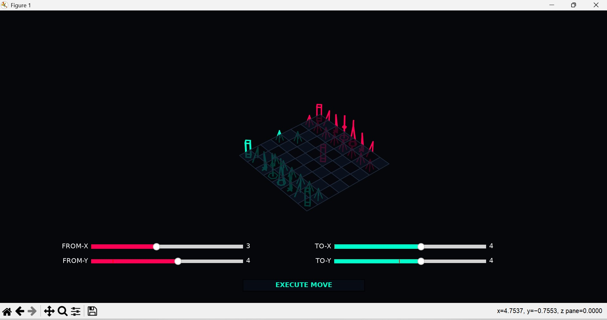
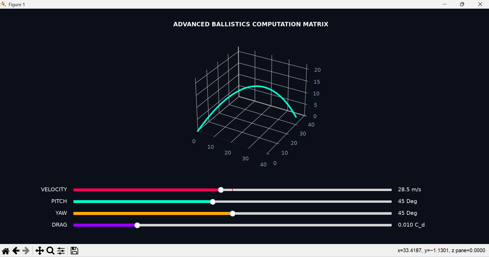
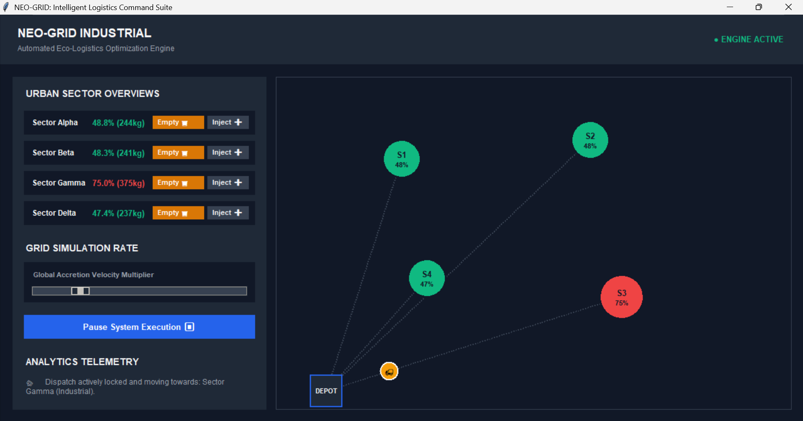

# UWC-PORTFOLIO
1. Dynamic 3D Threat Engine (chess_3d_real.py)
A spatial matrix mapping 32 interactive nodes in a 3D environment.
Algorithm: Multi-directional ray-casting for real-time line-of-sight tracking.
Functionality: Implements dynamic memory management to re-calculate threat vectors instantaneously upon unit relocation.
Utility: Models obstacle avoidance and sensor perimeter mapping.

3. 3D Cyberpunk Physics Engine (projectile_sim.py)
A continuous numerical solver for ballistics.
Physics: Computes gravitational pull (g) integrated with aerodynamic drag coefficients (C_d).
Functionality: Real-time telemetry sliders for velocity, pitch, and yaw.
Utility: Scalable to drone path planning and high-resistance trajectory modeling.

5. Sustainability Bridge:
The architectural logic here extends beyond simulation. By applying these coordinate-tracking systems to waste management logistics, my algorithms solve the Traveling Salesperson Problem (TSP) to minimize carbon emissions and optimize route efficiency for urban infrastructure.
Developed for UWC academic portfolio and computational research.

Technical Stack
Languages: Python
Libraries: Matplotlib, NumPy, SciPy (Numerical Analysis)
Tools: Git/GitHub, VS Code Terminal, Command Line Interface (CLI)
